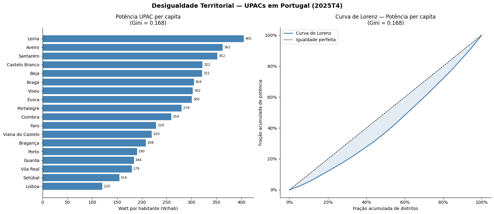
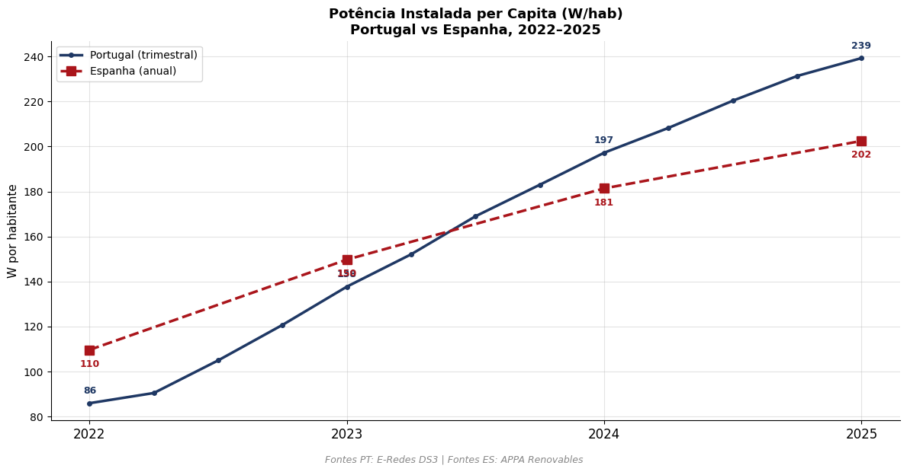
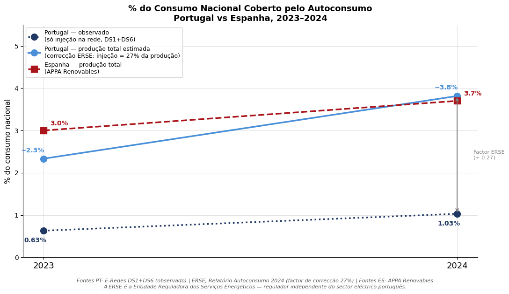
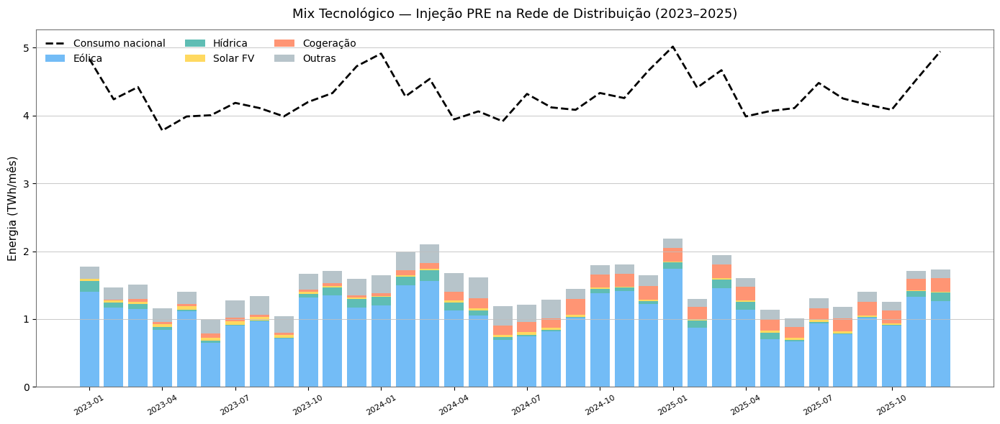
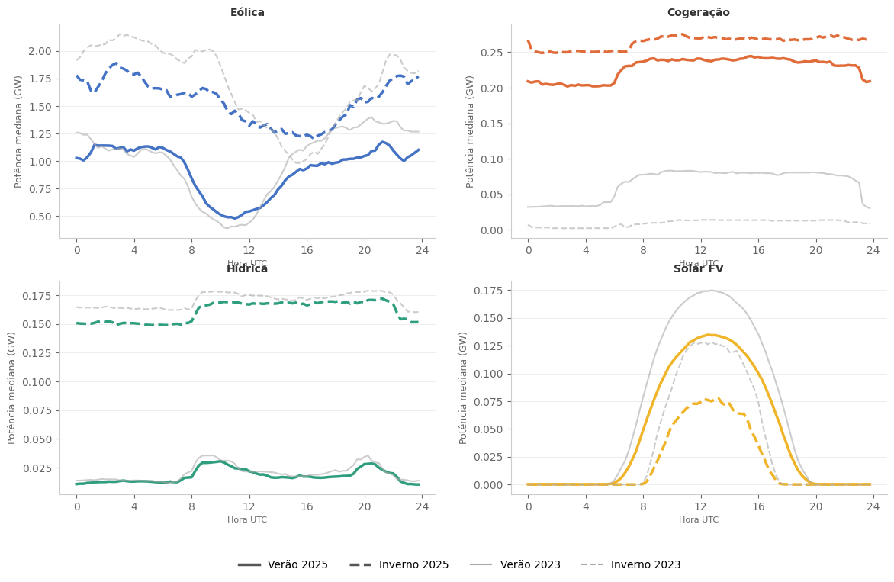
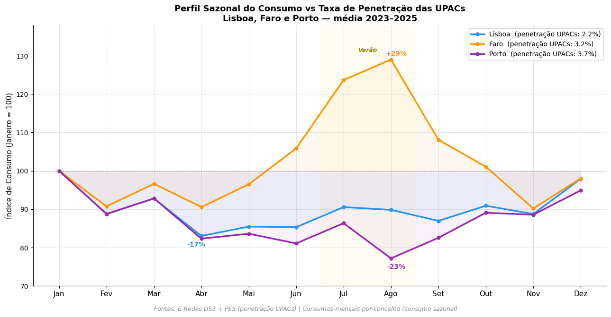
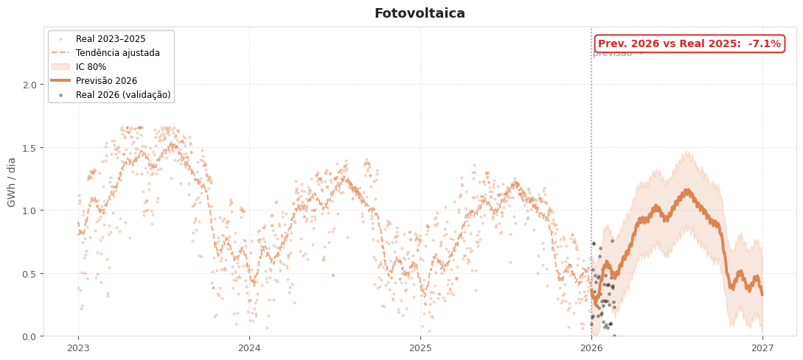
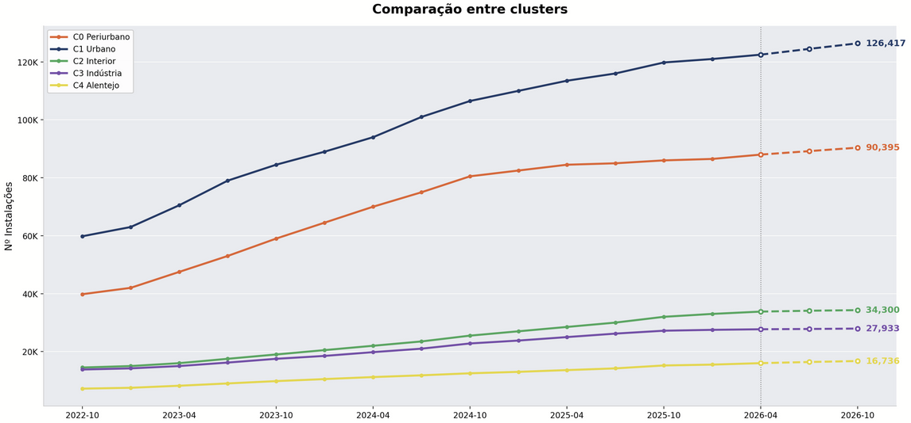

# Observatório da Descentralização Energética

**Plataforma analítica para a Produção em Regime Especial e o autoconsumo em Portugal.**
Projeto Final Aplicado em Ciência de Dados · ISCTE-IUL × E-Redes · 2026.

[**Aceder ao Observatório (acesso por convite)**](https://pfacd-eredes-grupo14.streamlit.app/) &nbsp;·&nbsp; [Pedir acesso](mailto:rodrigoarcsousa@gmail.com)

---

## Contexto

Capstone do Mestrado em Ciência de Dados do ISCTE-IUL, desenvolvido em parceria com a **E-Redes**
(operadora da rede de distribuição elétrica portuguesa) ao longo de 14 semanas. O trabalho
respondeu a uma questão estratégica concreta: *como está a descentralização energética a
reconfigurar a rede de distribuição em Portugal — e o que devemos aprender disso para a próxima
década?*

A plataforma resultante consolida 13 trimestres de dados oficiais da E-Redes em duas camadas
analíticas — o parque de **Unidades de Produção em Autoconsumo (UPAC)** e o **mix renovável da
Produção em Regime Especial (PRE)** — e disponibiliza ferramentas de leitura territorial,
benchmarking ibérico e simulação de cenários.

---

## Problema

O sistema elétrico português está a descentralizar a um ritmo notável (+180% de potência
ligada à distribuição em três anos) mas a leitura agregada esconde três tensões estruturais:

- **Concentração assimétrica do investimento** — cinco distritos absorvem cerca de 60% da
  potência instalada; Lisboa, com 1,4 milhões de clientes, estagna em 2,2% de penetração.
- **Pressão operacional sobre a rede de distribuição** — fluxos reversos em concelhos com
  alta densidade solar exigem reforços MT e gestão ativa da procura.
- **Recomposição silenciosa do mix** — a fotovoltaica está a migrar para a transmissão
  (utility-scale); a cogeração industrial explodiu pós-choque OMIE (+434% entre 2023-2025).

Sem visualização territorial integrada, estas dinâmicas tornam-se invisíveis para quem
planeia capacidade de rede.

---

## Solução

Um **observatório energético interativo** organizado em quatro grupos:

- **Camada I — UPAC & Descentralização** (9 vistas)
  Crescimento, risco sistémico, sazonalidade, geografia, papel sistémico, penetração distrital,
  concentração de investimento (curva de Lorenz + Gini), modelação (Prophet + clusterização
  K-Means k=5), e o caso especial Portugal vs Espanha.

- **Camada II — Mix Renovável (PRE)** (4 vistas)
  Composição tecnológica (mix mensal interativo), solar na distribuição, perfis operacionais
  intradiários e previsão Prophet/SARIMA até 2030.

- **Aplicação & Síntese**
  **Simulador de Autoconsumo Coletivo** com cenários paramétricos para Lisboa
  (sliders ao vivo: penetração-alvo, CPEs/ACC, potência/ACC, horizonte) e três blocos
  de saída: dimensionamento operacional, **avaliação económica** (CAPEX, payback, VAL a 15
  anos) e **equivalência ambiental** (CO₂ evitado, árvores, carros equivalentes).
  **Sugestões** estratégicas em tom exploratório.

A plataforma corre em **dark mode editorial** com paleta institucional preta + ouro,
gráficos Plotly interativos para análises onde a exploração acrescenta valor, e exhibits
estáticos onde a clareza analítica é prioridade.

---

## Principais resultados

| Área | Resultado |
|---|---|
| Dataset analisado | **13 trimestres** · 18 distritos · 5 tecnologias PRE · ~250k registos brutos |
| Vistas analíticas | **15 secções** organizadas em narrativa Camada I → II → Síntese |
| Concentração territorial | **Gini 0,17** na potência per capita · top-5 distritos = ~60% do total |
| Reposicionamento ibérico | PT em 2025 a **239 W/hab**, à frente de ES (202 W/hab) per capita |
| Caso de negócio Lisboa | Atingir a média nacional (~4,5%) exigiria **~2.193 ACC** e **175 MW**, com payback ~3,6 anos e VAL 15a de ~269 M€ |
| Forecasting | Prophet por tecnologia (Solar, Eólica, Hídrica, Cogeração, Outras) + SARIMA para quota renovável |
| Clusterização | **5 perfis territoriais** (K-Means k=5, silhouette 0,27) com recomendação operacional dedicada |

---

## Stack

**Dados & modelação** · Python 3.11 · Pandas · NumPy · Shapely + Pyproj · Scikit-Learn (K-Means) · Prophet · SARIMA
**Aplicação & visual** · Streamlit 1.33+ (`st.navigation`, `st.fragment`) · Plotly · CSS premium centralizado (preto + ouro e-Redes)
**Geo** · GeoJSON CAOP (Portugal) simplificado offline para 180 KB · pré-agregação de DS3 em CSVs derivados pequenos
**Infra** · GitHub privado · Streamlit Cloud · gate de acesso por password (TOML em Cloud Secrets) · QR code vetorial

---

## Galeria

### Desigualdade territorial — curva de Lorenz + Gini

Concentração da potência instalada em Portugal continental (2025T4). Gini 0,17 — desigualdade moderada — com Leiria e Aveiro a liderar e Lisboa a fechar a tabela.

### Portugal vs Espanha — per capita reposiciona a narrativa

Em escala absoluta Espanha é ~4× maior. Mas, normalizada por habitante, Portugal **ultrapassa** Espanha em 2025 (239 vs 202 W/hab).

### Leitura crítica dos dados ibéricos

Quando se aplica o fator de correção da ERSE (injeção ≈ 27% da produção), a quota de consumo coberto por autoconsumo em PT salta de 1,03% para ~3,8% — alcançando o valor reportado para Espanha. Caso de estudo sobre **observabilidade vs estimação**.

### Mix tecnológico PRE — distribuição (2023-2025)

Eólica domina a base; cogeração engorda fortemente desde 2023 (efeito OMIE 2022); fotovoltaica mantém-se pequena na DSO por migrar para a transmissão.

### Perfis operacionais intradiários

Médias horárias por tecnologia, comparando verão/inverno 2023 vs 2025. Mostra o "sino" solar do meio-dia, a planura quase despachável da cogeração e o reforço noturno da eólica.

### Caso complementar — turismo no Algarve

Pico de consumo de **+29% no verão em Faro** (turismo), contra recuos de Lisboa e Porto. Onde a procura sobe no verão, o solar casa naturalmente com o consumo — base de uma das sugestões estratégicas.

### Previsão Prophet — Fotovoltaica

Projeção 2026 com IC 80% e validação contra os primeiros dados reais de 2026. Desvio −7% face a 2025, coerente com a fuga para a transmissão.

### Modelação — crescimento esperado por cluster

Crescimento projetado do número de instalações por cluster territorial — qual acelera e qual satura.

---

## Acesso à plataforma

<table>
<tr>
<td width="45%" valign="top">

### Live demo
**[pfacd-eredes-grupo14.streamlit.app](https://pfacd-eredes-grupo14.streamlit.app/)**

A plataforma está em produção mas o acesso é controlado por password. Quem chega à URL vê uma página de entrada com os indicadores principais e o contacto.

Para uma demo guiada ou para receber a password de acesso, contacte:
**rodrigoarcsousa@gmail.com**

</td>
<td width="50%" align="center">

*QR direto para a plataforma*

</td>
</tr>
</table>

---

## O que está aqui (e o que não está)

Este repositório é a **vitrina pública** do projeto — não é o código-fonte. Está aqui:

- Esta página (README) com o framing analítico completo.
- Galeria de gráficos finais (a saída visível do trabalho).
- Brand mark e QR code do produto.

**Não está aqui** (e é deliberado):
- O código completo da aplicação Streamlit, dos pipelines de dados, dos modelos Prophet/SARIMA e da clusterização.
- Os datasets brutos da E-Redes (DS1-DS8) e séries derivadas, que são proprietárias.
- Notebooks de exploração, ETL e validação.
- Templates internos, segredos de deploy e configurações sensíveis.

O código vive num repositório privado e o acesso à aplicação é gated. Para code review, walkthrough técnico ou avaliação detalhada, basta pedir.

---

## Sobre

Projeto desenvolvido por **Rodrigo de Sousa** com o Grupo 14 do PFACD (ISCTE-IUL), em
parceria com a E-Redes. Open to discussion para oportunidades de estágio, consultoria
de dados no setor energético ou licenciamento da plataforma.

· [LinkedIn](https://www.linkedin.com/) · ✉ rodrigoarcsousa@gmail.com
